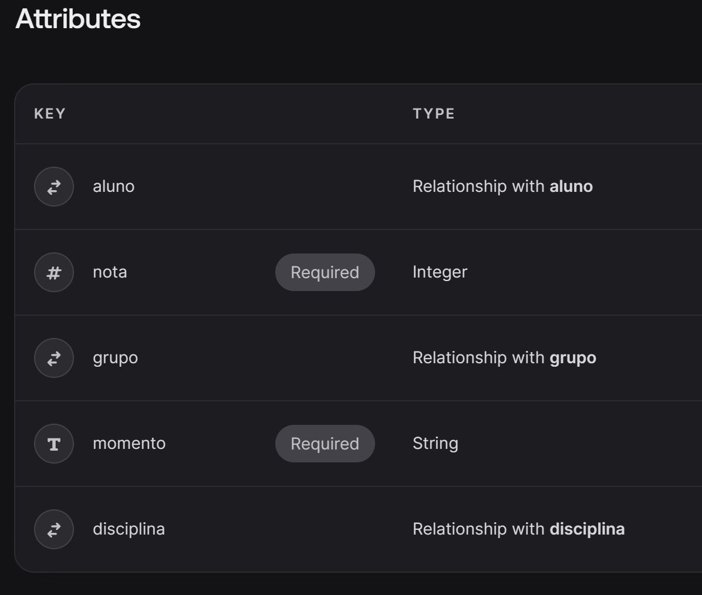

# iColab - Aplicação de Colaboração para Professores e Alunos

## Descrição
iColab é uma aplicação desenvolvida em React, TypeScript, Appwrite, Tailwind e Shadcn, projetada para facilitar a colaboração entre professores e alunos. A aplicação oferece recursos específicos para cada tipo de usuário, permitindo uma gestão eficiente de disciplinas, módulos, grupos e tarefas.

## Funcionalidades Principais

### Para Professores
- Gestão de disciplinas e módulos.
- Criação e gestão de grupos.
- Visualização do histórico do grupo.
- Participação no chat do grupo.
- Atribuição de notas aos grupos e membros.
- Administração de tarefas para grupos.

### Para Alunos (Líderes de Grupo)
- Gestão de tarefas para organização do trabalho.
- Adição, remoção, edição e atribuição de tarefas.
- Envio de arquivos.
- Participação no chat do grupo.
- Visualização das notas dos membros do grupo.

### Para Outros Alunos
- Participação no chat do grupo.
- Visualização das notas dos membros do grupo.
- Execução de tarefas, excluindo criação ou exclusão.

## Detalhes do Projeto

- **Nome da Aplicação:** iColab
- **Desenvolvida para:** Trabalho da unidade curricular de Desenvolvimento de Interfaces
- **Alunos:** A042542, A042807, A042045
- **Copyright:** Karim Patatas @Sen2Pi

## Configuração do Projeto
1. Clone o repositório.
```javascript CMD
git clone https://github.com/Sen2pi/iColab.git
```
2. Instale as dependências usando `yarn install` ou `npm install`.
```javascript CMD
npm install 
```
3. Configure as variáveis de ambiente para o Appwrite e outros serviços necessários.
*Notas 
4. Execute o aplicativo usando `yarn start` ou `npm start`.
```javascript CMD
npm start 
```
## Tecnologias Utilizadas
- React
- TypeScript
- Appwrite (API para gerenciamento de usuários, autenticação, etc.)
- Tailwind CSS (Framework de estilos)
- Shadcn (Biblioteca gráfica ou efeitos visuais)

## Contribuição
Contribuições são bem-vindas! Sinta-se à vontade para criar forks, propor melhorias ou relatar problemas. 
```javascript CMD
dr.karim.patata@gmail.com
```

## Licença
Este projeto é licenciado sob a [Nome da Licença] - veja o arquivo [LICENSE.md](LICENSE.md) para detalhes.

# React + TypeScript + Vite

This template provides a minimal setup to get React working in Vite with HMR and some ESLint rules.

Currently, two official plugins are available:

- [@vitejs/plugin-react](https://github.com/vitejs/vite-plugin-react/blob/main/packages/plugin-react/README.md) uses [Babel](https://babeljs.io/) for Fast Refresh
- [@vitejs/plugin-react-swc](https://github.com/vitejs/vite-plugin-react-swc) uses [SWC](https://swc.rs/) for Fast Refresh

## Expanding the ESLint configuration

If you are developing a production application, we recommend updating the configuration to enable type aware lint rules:

- Configure the top-level `parserOptions` property like this:

```js
export default {
  // other rules...
  parserOptions: {
    ecmaVersion: 'latest',
    sourceType: 'module',
    project: ['./tsconfig.json', './tsconfig.node.json'],
    tsconfigRootDir: __dirname,
  },
}
```

- Replace `plugin:@typescript-eslint/recommended` to `plugin:@typescript-eslint/recommended-type-checked` or `plugin:@typescript-eslint/strict-type-checked`
- Optionally add `plugin:@typescript-eslint/stylistic-type-checked`
- Install [eslint-plugin-react](https://github.com/jsx-eslint/eslint-plugin-react) and add `plugin:react/recommended` & `plugin:react/jsx-runtime` to the `extends` list
